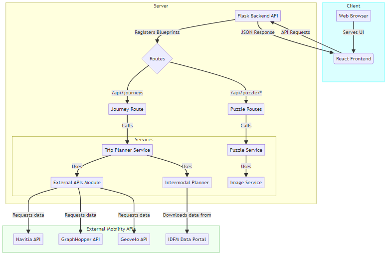

# Template ReadMe des projets - [Nom du projet]

Développée pour le Hackathon IDFM 2025, cette application incite les employés à préférer le  vélo par rapport a la voiture en "gamifiant" leurs trajets domicile-travail via des défis ludiques et réguliers, basés sur un calculateur intermodal innovant.

## Présentation du projet

Ce projet a été développé dans le cadre du Hackathon Mobilités 2025, organisé par Île-de-France Mobilités les 13 et 14 novembre 2025.

Ce projet implémente une application "fullstack" (complète) pour le défi "Aider les entreprises à décarboner les mobilités de leurs salariés". Il se compose d'une API (interface de programmation) back-end en Python Flask et d'une application web front-end en React/TypeScript. L'objectif est de "gamifier" et d'encourager les déplacements domicile-travail éco-responsables des employés en proposant une compétition intra et inter entreprise pour la résolution de puzzle lors de "weekly challenge".

### Le problème et la proposition de valeur

Le report modal vers des modes de transport plus écologiques reste un défi majeur. Les données de l'étude 2022 sur les émissions de gaz à effet de serre en Île-de-France sont parlantes : malgré une forte utilisation des transports en commun (plus de 50 %), plus d'un tiers des usagers (35 %) continue d'utiliser la voiture, tandis que le vélo ne représente que 4 %. Sur le territoire d'IDFM, 13 % des émissions de GES liées aux transports proviennent des déplacements domicile-travail, et la région compte 6 millions d'emplois salariés. Le potentiel de décarbonation est donc considérable.

### La solution

Pour encourager le report modal vers le vélo, nous avons développé une solution complète basée sur la gamification, répondant aux enjeux actuels de mobilité durable en entreprise.


Le cœur de notre projet est d'animer des challenges intra et inter-entreprises qui motivent les employés à suivre des trajets décarbonés grâce à des récompenses collectées sur leur parcours. Chaque semaine, ils résolvent des casse-têtes et peuvent gagner des récompenses, telles que des bons d'achat pour du matériel cycliste ou des tickets pour des événements culturels.

La distribution des récompenses s'appuie sur un calculateur d'itinéraires intermodal. Il combine les forces d'outils de planification tels que Navitia, Géovélo et GraphHopper (pour la voiture), tout en intégrant précisément les données de parkings vélos et relais fournies par Île-de-France Mobilités (IDFM). Ce calculateur offre une vision holistique de l'offre de transport et permet de distribuer des récompenses de façon équitable, en tenant compte de l'environnement de l'utilisateur et de son accès aux différentes solutions de transport à proximité.

Notre approche se distingue des événements annuels comme "Mai à vélo" par des périodes de challenge plus courtes et régulières, idéales pour ancrer durablement de nouvelles habitudes de mobilité au quotidien. De plus, cette solution offre un outil concret et efficace pour les entreprises désireuses d'intégrer un volet mobilité pertinent dans leurs Négociations Annuelles Obligatoires (NAO), transformant une obligation en une opportunité de dynamiser la mobilité de leurs collaborateurs.

Le projet intègre également une dimension interentreprises afin de stimuler l'esprit de challenge et de valoriser les efforts de chaque organisation dans la transition écologique, tout en leur offrant la possibilité de les faire remonter aux autorités publiques.


Voici un schéma d'architecture expliquant notre solution :




### Capitaliser sur l'audience d'Île-de-France Mobilités

Nous avons également conçu notre solution de manière à pouvoir s'intégrer naturellement au sein de l'écosystème IDFM, notamment dans l'application Île-de-France Mobilités. En proposant des fonctionnalités compatibles avec cette application, nous permettons au projet de bénéficier immédiatement du trafic très important et de la forte visibilité d'IDFM.

Cette intégration offrirait **un levier puissant pour augmenter l'audience**, stimuler l'engagement des entreprises et accélérer la transition vers des mobilités décarbonées. Les entreprises participantes pourraient également profiter de cette exposition pour valoriser leurs actions auprès d'un large public, renforçant ainsi leur image et leur impact dans la transition écologique.

### Les problèmes surmontés et les enjeux en matière de données

Le calculateur intermodal n'étant pas fourni par les API de PRIM, nous avons dû consacrer une demi-journée à son développement. Le principal défi résidait dans le volume massif de données à traiter, ce qui a nécessité un tri important pour isoler les informations les plus pertinentes.

### Et la suite ? 

- Renforcer l'accessibilité et l'inclusivité : Intégrer une fonction de synthèse vocale (Text-to-Speech) et adapter les mécaniques de jeu pour les rendre pleinement accessibles aux personnes en situation de handicap.

 * Dynamiser l'engagement de manière frugale grâce à l'IA** : Mettre en place une intelligence artificielle capable d'automatiser l'animation des challenges, de personnaliser la motivation et d'encourager activement les utilisateurs, tout en adoptant une approche frugale.

- Garantir la fiabilité des données : Mettre en place un système de validation automatique des trajets réellement effectués, afin de prévenir les tentatives de fraude et d'assurer l'intégrité du système.

## Installation et utilisation

### Prérequis

- Node.js (ou Bun) et npm/yarn pour le front-end

- Python 3.8+ et pip pour le back-end

### 1. Configuration du Back-end

Accédez au répertoire `back` :
```bash
cd back
```

Créez un environnement virtuel et installez les dépendances :

```bash
python -m venv venv
# On Windows
.\venv\Scripts\activate
# On macOS/Linux
source venv/bin/activate
pip install -r requirements.txt
```
Créez un fichier `.env` dans le répertoire `back` et ajoutez-y vos clés API :
```
NAVITIA_API_KEY=your_navitia_api_key
GRAPPHOPPER_API_KEY=your_graphhopper_api_key
GEOVELO_API_KEY=your_geovelo_api_key
```

Lancez le serveur back-end :
```bash
python main.py
```

L'API back-end sera disponible à l'adresse http://localhost:5000.

### 2. Configuration du Front-end

Accédez au répertoire `front` :
```bash
cd front
```

Installez les dépendances (en utilisant `bun` comme indiqué par `bun.lockb`, mais `npm` ou `yarn` fonctionneront également) :
```bash
bun install
# or npm install
```

Lancez le serveur de développement front-end :
```bash
bun run dev
# or npm run dev
```

L'application front-end sera disponible à l'adresse http://localhost:5173 (ou un autre port spécifié par Vite).

## La licence

Le code et la documentation de ce projet sont sous licence [MIT](LICENSE).